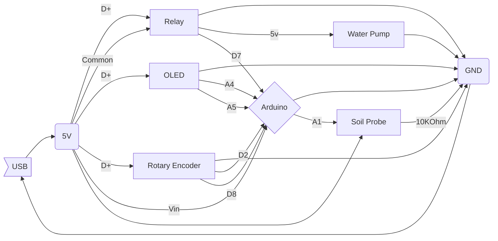

> Written with [StackEdit](https://stackedit.io/).
# Patrick McGuire's first good thing
This is my first attempt at documenting my tinkering. This project was inspired by and made for my best friend, Jerry Vance. He's the inspiration, generation, and motivation to get this done. Many thanks to Susan Mackey for her help in making this possible......
  
  - Arduino Nano
  - OLED Display (module)
  - Rotary Encoder (no module)
  - 5v Relay Switch (module)
  - 5v Water Pump (just a pump)
  - Soil Sensor (no module)
  
The basic idea is that this is a soil sensor that will show you soil saturation. If you set the watering trigger, the system will power on a water pump that will water the soil that is being measure with the sensor. This feedback loop will allow you to keep soil at a moisture level set by the watering trigger.

# Assembly and Schematics

  - The OLED is defined as I2C, so the data and clock are connected to the A4 and A5 analog pins, respectively.
  - The Rotary Encoder's A and B pins are hooked up to the D8 and D2 digital pins, respectively. The C and E pins are grounded and the D pin is not in use (it controls the push button switch portion of the encoder).
  - The Relay's signal is read from the D7 digital pin.
  - The soil sensor is a homemade slice of the pie. Basically, there are two soil probes that will go into the soil about 1" apart about 2" into the soil. One of the probes is hooked directly to the +5v power rail. The other probe is hooked up to the A1 analog pin AND has a path to ground that is resisted with 10K Ohms.

